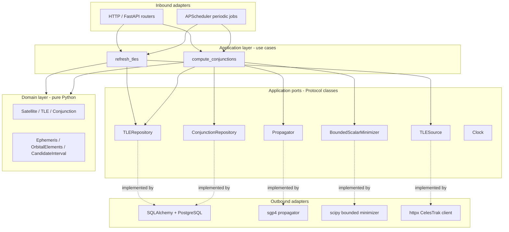
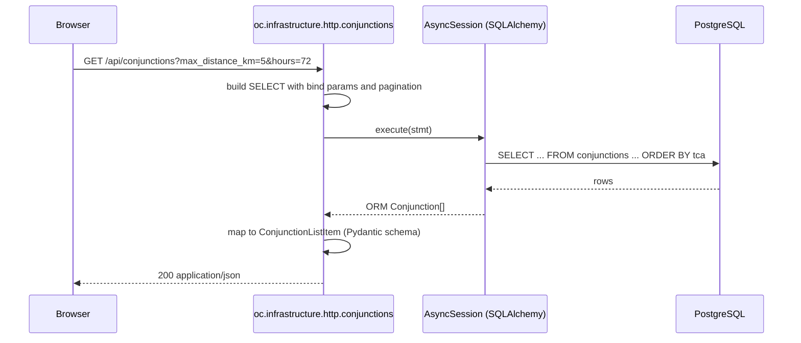
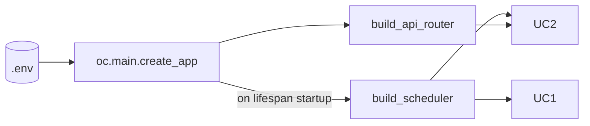

# Architecture

The backend follows a strict **hexagonal (ports-and-adapters)
architecture**. The domain knows nothing about HTTP, SQL, or sgp4. The
application layer expresses every use case in terms of port protocols.
The infrastructure layer is the only place where third-party drivers
are imported. The composition root in `oc.main` wires concrete adapters
into FastAPI dependencies.

## Hexagonal layout

## Port / adapter mapping

| Port (`oc.application.ports`)         | Concrete adapter (`oc.infrastructure`)                          |
| ------------------------------------- | --------------------------------------------------------------- |
| `TLESource.fetch`                     | `tle_sources.celestrak.CelestrakTLESource`                      |
| `TLERepository.upsert_parsed_tles`    | `persistence.tle_repository.SQLAlchemyTLERepository`            |
| `TLERepository.latest_tle_per_active_satellite` | `persistence.tle_repository.SQLAlchemyTLERepository`  |
| `Propagator.propagate` / `.orbital_elements` | `propagation.sgp4_propagator.SGP4Propagator`             |
| `BoundedScalarMinimizer.minimize`     | `numerics.scipy_minimizer.ScipyBoundedMinimizer`                |
| `Clock.now`                           | `datetime.now(UTC)` (no dedicated adapter shipped yet)          |

## Request flow: `GET /api/conjunctions`

The list endpoint reads from the materialised `conjunctions` table
populated by the scheduled `compute_conjunctions` use case. The detail
endpoint follows the same pattern but eager-loads the originating TLEs.

## Composition root

`create_app` is the only place where adapters and use cases meet. Tests
override `Settings`, replace the database engine with an in-memory
SQLite, and never need to touch the use cases directly.

## Why hexagonal here?

- **Replaceable adapters.** Swapping CelesTrak for Space-Track means
  writing a new `TLESource` adapter; the use case is untouched.
- **Fast tests.** The 28-test backend suite runs in ~3 seconds against
  in-memory SQLite. The screening tests bypass HTTP entirely by
  calling the use case with a fake propagator state.
- **Honest dependency graph.** `mypy --strict` enforces that nothing in
  `oc.domain` or `oc.application` imports SQLAlchemy, FastAPI, sgp4,
  scipy, or httpx.
